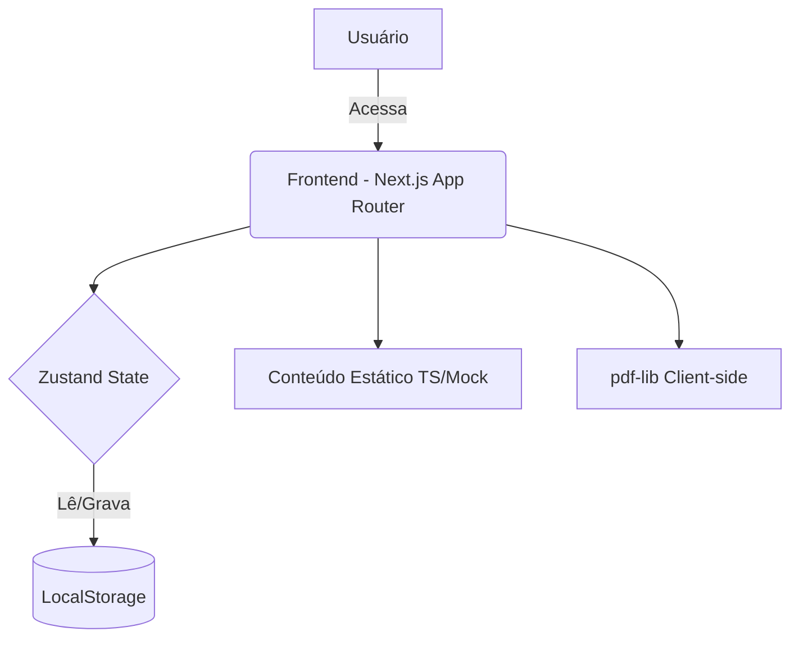
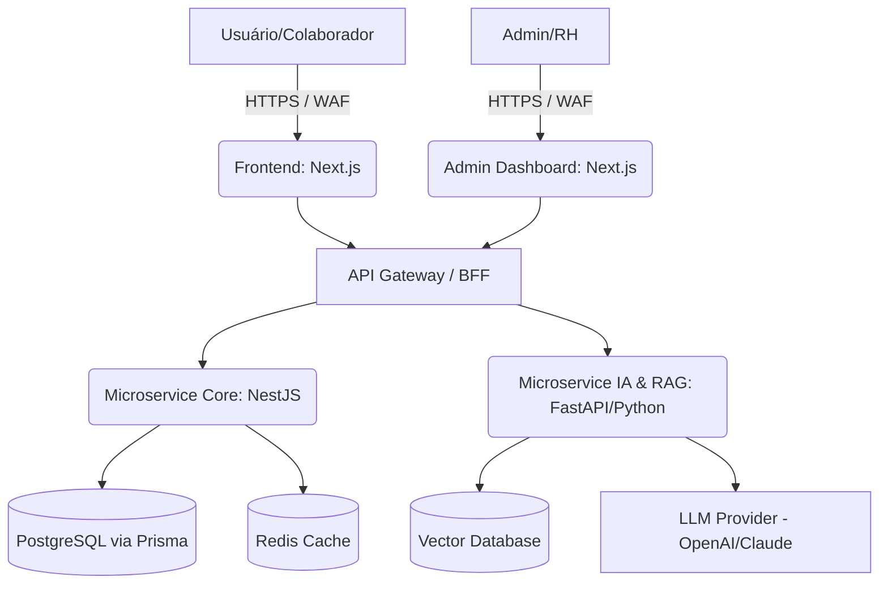

# RELATÓRIO EXECUTIVO DE AUDITORIA FORENSE TÉCNICA
**Projeto**: Portal de Onboarding ATLASGR
**Fase Auditada**: Protótipo Inicial (Fase 1)

## 1. Relatório Executivo
A presente auditoria técnica comprova que o projeto atual encontra-se em um estágio de **protótipo puramente voltado a Frontend (Fase 1)**. A arquitetura corporativa solicitada (Enterprise, DDD, Clean Architecture, Microsserviços e Inteligência Artificial) encontra-se em estado **ausente**. As funcionalidades disponíveis são simuladas no lado do cliente utilizando `localStorage` (via `zustand/middleware` persist), sem persistência distribuída e sem backend verdadeiro. Todo o módulo de administração é suportado por sementes de demonstração (`seedDemo.ts`). Trata-se de uma interface de validação visual e interativa que não atende ainda aos critérios de produção corporativa ponta a ponta.

## 2. Relatório Técnico Completo
Foi conduzida a análise detalhada dos artefatos:

- **Arquitetura**: O sistema é monólito em Next.js (App Router). Não existem práticas de Clean Architecture, camadas (Entities, Use Cases, Repositories), Dependency Injection, ou estruturas de pacotes isolados.
- **Backend & Banco de Dados**: Ausentes. Nenhuma API de fato, sem ORM (`prisma`), sem Postgres, sem tabelas ou entidades persistidas. Apenas mocks.
- **Inteligência Artificial & Knowledge Engine**: Ausentes. Não há pipelines RAG, NLP, LangChain, OpenAI ou LLMs configurados no repositório.
- **Frontend & Conteúdo**: 3 de 15 módulos implementados estaticamente no código. Glossário implementado localmente, gamificação simulada.

## 3. Matriz de Conformidade

| Requisito | Esperado | Encontrado | Status | Evidência | Observação |
|-----------|-----------|------------|--------|-----------|------------|
| **Clean Architecture** | Sim | Não | 🔴 Ausente | `app/`, `lib/` e `components/` | Padrão Next.js simples sem isolamento de domínio. |
| **SOLID, DDD, Repository, DI** | Sim | Não | 🔴 Ausente | Raiz do repositório | Nenhuma abstração arquitetural implementada. |
| **Modularização** | Sim | Sim | 🟡 Parcial | `components/` e `content/` | Separação de pastas UI vs Lógica incipiente. |
| **Monorepo e Packages** | Sim | Não | 🔴 Ausente | `package.json` root | Trata-se de um projeto stand-alone. |
| **Estrutura (apps, packages, database...)** | Sim | Não | 🔴 Ausente | Tree do diretório | Apenas app, components, content e lib existem. |
| **Phase 0 (Knowledge Engine, RAG, ETL...)** | Sim | Não | 🔴 Ausente | Raiz do projeto | Nenhum script Python, Node, ou engine. |
| **Conteúdos Completos** | 12 categorias | 2 | 🟡 Parcial | `content/modules/`, `content/glossary.ts` | Faltam products, services, faq, cases, etc. |
| **Glossário** | Completo | Simples | 🟡 Parcial | `content/glossary.ts` | Tem busca e popover. Faltam links e vídeos. |
| **Módulos da Trilha** | 15 módulos | 3 | 🟡 Parcial | `content/modules/` | 12 módulos são apenas placeholders (em construção). |
| **Quiz** | Completo | Simples | 🟡 Parcial | `content/quizzes/index.ts` | Possui aleatorização (`Math.random()`), 70% aprovação, mas não histórico de tentativas. |
| **Gamificação** | Completo | Simples | 🟡 Parcial | `lib/gamification.ts` | XP, Levels e Streak existem. Faltam lojas, moedas, patentes. |
| **Certificado** | Completo | Sim | 🟡 Parcial | `components/certificate/generateCertificatePdf.ts` | PDF gerado (`pdf-lib`), Hash (`sha256Hex`), UUID (`genId`). Sem validação online. |
| **Dashboard** | 6 Perfils | 2 | 🟡 Parcial | `app/dashboard/page.tsx`, `app/admin/page.tsx` | Admin utiliza seed data (`seedDemo.ts`). Gestor, RH e IA ausentes. |
| **IA (Atlas Mentor, LLM, Vetores)** | Sim | Não | 🔴 Ausente | Raiz | Nenhuma biblioteca relacionada. |
| **Busca Global (CTRL+K, Módulos)** | Sim | Não | 🔴 Ausente | `app/` | Existe apenas a busca no glossário. |
| **Backend & Banco de Dados** | NestJS/Prisma | NextJS/Mock | 🔴 Ausente | Raiz | Totalmente fake/inexistente. |
| **Testes** | Unit/Integra/E2E | Unitário | 🟡 Parcial | `vitest.config.ts`, `lib/utils.test.ts` | 18 testes unitários rodando e passando. Sem E2E ou Integr. |
| **Performance** | Otimizado | Não | 🟡 Parcial | `components/brand/Logo.tsx` | Imagens usam tag `` comum, sem `next/image` ou lazy loading dinâmico. |
| **Segurança** | Completa | Nenhuma | 🔴 Ausente | Raiz | Sem JWT, RBAC, Rate Limiting (ausência de backend). |
| **Documentação** | 9 arquivos | 1 | 🟡 Parcial | `README.md` | Não existem ADR, Database.md, Api.md, etc. |

*Status: 🟢 Implementado \| 🟡 Parcial \| 🔴 Ausente \| ⚫ Placeholder*

## 4. Lista de Não Conformidades
1. Arquitetura em desacordo com as diretrizes Enterprise (ausência de DDD, Clean Architecture e Monorepo).
2. Ausência total de backend e banco de dados relacional.
3. Tratamento de dados de dashboard administrativo falso (hardcoded `seedDemo.ts`).
4. Persistência de dados sensíveis e métricas unicamente no client-side (`localStorage`).
5. Imagens sem otimização nativa do framework (desativação do `next/image`).
6. Total ausência da IA, RAG e Knowledge Engine solicitados para a Fase 0.
7. Documentação técnica ausente, violando os guias de contribuição arquitetural.

## 5. Lista de Riscos
1. **Risco de Segurança (Alto)**: Aprovação em quizzes e emissão de certificados processados puramente no frontend, sujeitos a manipulação (bypass) pelo usuário no `localStorage`.
2. **Risco de Escalabilidade (Alto)**: Como não existe monorepo e separação de subdomínios, continuar o desenvolvimento desta forma gerará um monólito tightly coupled de difícil manutenção e evolução.
3. **Risco de Conformidade com LGPD (Médio)**: Mesmo indicando que os dados ficam apenas no navegador, a evolução exigirá persistência de PII. Não há middlewares de proteção ou hashing robustos preparados.

## 6. Lista de Melhorias Prioritárias
1. **Bootstrapping Arquitetural**: Criar ambiente monorepo (Nx ou Turborepo), dividindo em `apps/` (frontend, admin, api) e `packages/` (ui, core, config).
2. **Setup do Backend**: Instanciar um serviço NestJS com Prisma e PostgreSQL.
3. **Migração de Estado**: Transferir a lógica de gamificação, progresso e autenticação (Zustand) para endpoints validados no servidor via JWT.
4. **Implementação de IA Base**: Instanciar vetorização (VectorDB) para pesquisa semântica real (RAG) do conteúdo atualmente engessado no Frontend.

## 7. Roadmap de Correção
- **Semana 1**: Refatoração da estrutura de pastas para Monorepo (Turborepo). Separação do pacote de UI.
- **Semana 2**: Criação do Backend (NestJS + Prisma) e definição do modelo de dados (`Users`, `Modules`, `Progress`, `Certificates`).
- **Semana 3**: Implementação de autenticação e RBAC (Roles). Ligação do frontend Next.js com a API NestJS.
- **Semana 4**: Migração dos conteúdos hardcoded (`content/`) para seeds no banco de dados e arquivos estáticos (S3).

## 8. Roadmap de Evolução Enterprise
- **Trimestre 1**: Estabelecimento da "Phase 0" da Inteligência Artificial (Scripts ETL, Embeddings OpenAI, Pinecone/Weaviate), gerando o RAG base.
- **Trimestre 2**: Implementação de Busca Global (Elasticsearch / Algolia) e Atendimento Inteligente (Atlas Mentor AI).
- **Trimestre 3**: Evolução da Gamificação e Dashboard com Analytics real em tempo real, abrangendo visão de Gestor, RH e Instrutor.

## 9. Diagrama da Arquitetura Atual

## 10. Diagrama da Arquitetura Recomendada

## Score Final

| Item | Nota (0 a 100) |
|---|---|
| Arquitetura | 10 |
| Backend | 0 |
| Frontend | 70 |
| Conteúdo | 30 |
| Gamificação | 40 |
| Quiz | 40 |
| Certificados | 40 |
| Analytics | 10 |
| Segurança | 0 |
| Performance | 50 |
| Documentação | 15 |
| Testes | 30 |
| Banco | 0 |
| IA | 0 |
| Knowledge Engine | 0 |
| RAG | 0 |
| Busca | 10 |
| Glossário | 40 |
| Dashboard | 30 |
| Admin | 15 |

- **Índice Geral de Conformidade**: 21.5%
- **Índice de Maturidade Arquitetural**: 5%
- **Índice de Qualidade de Código**: 40% (o código existente é limpo, porém longe de padrão corporativo distribuído).
- **Índice de Prontidão para Produção**: 0% (inviável utilizar em ambiente corporativo real sem backend e persistência).
